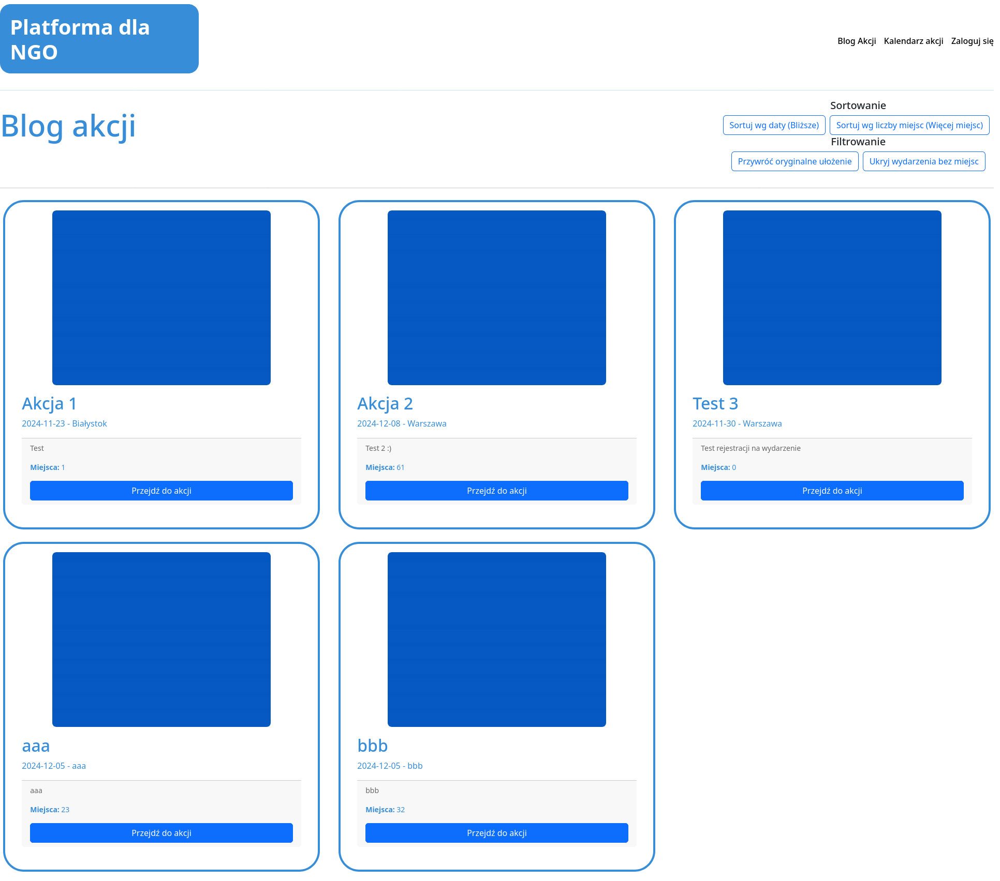

### Dla niezalogowanych użytkowników:
- **Przeglądanie wydarzeń**: Niezalogowani użytkownicy mogą przeglądać listę wszystkich dostępnych wydarzeń na stronie głównej aplikacji lub w widoku kalendarza akcji.

- **Szczegóły wydarzenia**: Użytkownicy mogą zobaczyć szczegóły wydarzenia, takie jak opis, data, godzina, lokalizacja oraz liczba dostępnych miejsc.

- **Rejestracja i logowanie**: Niezalogowani użytkownicy mogą zarejestrować się lub zalogować do aplikacji, aby móc zapisać się na wydarzenia i mieć dostęp do funkcjonalności strony.

