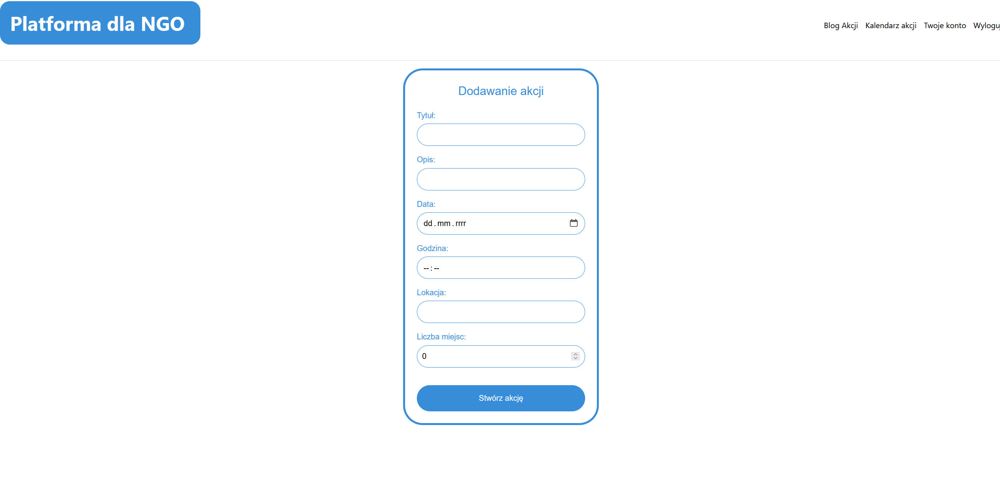
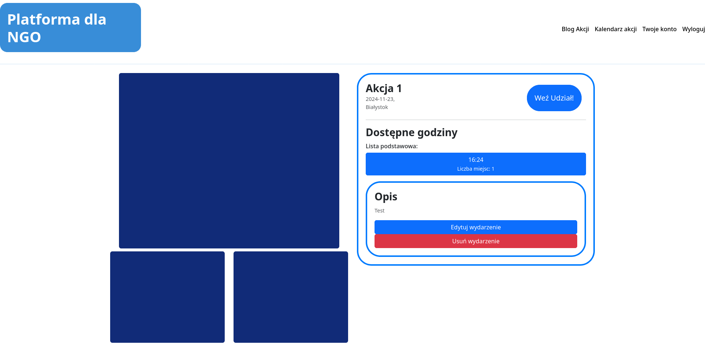
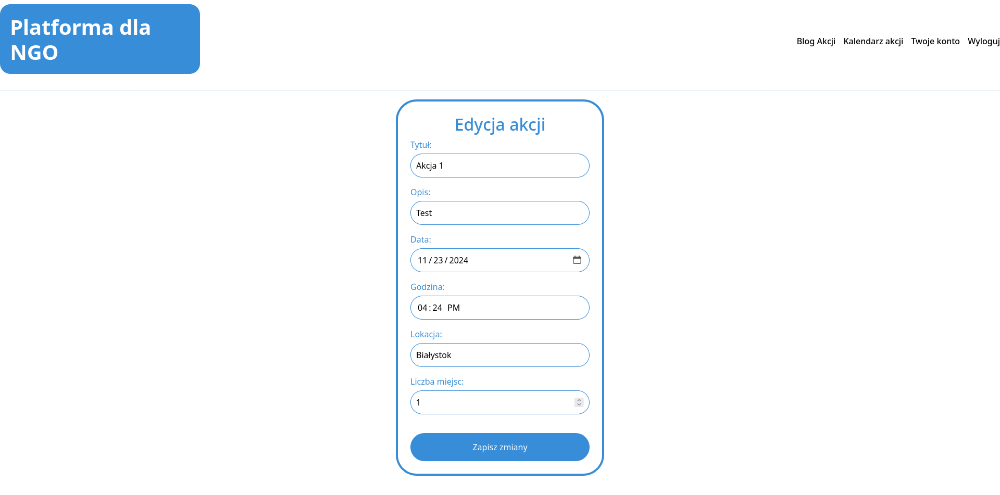
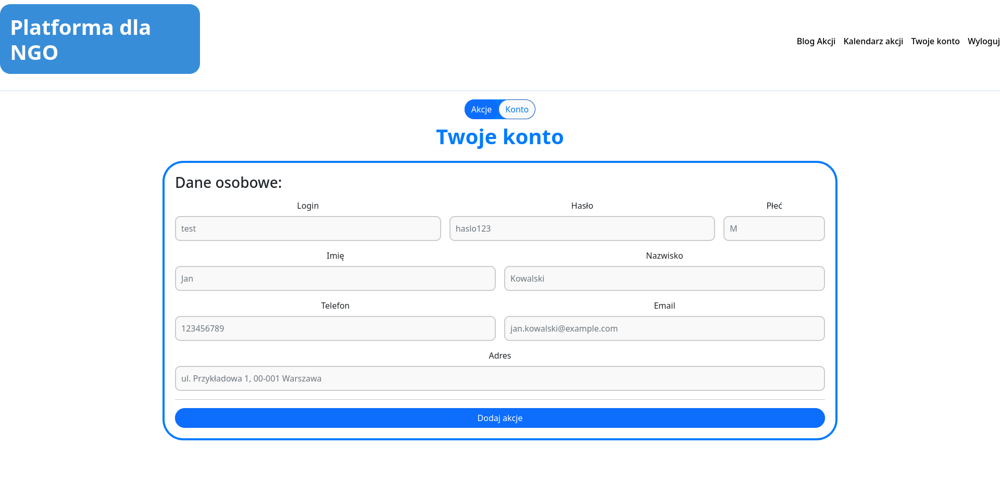
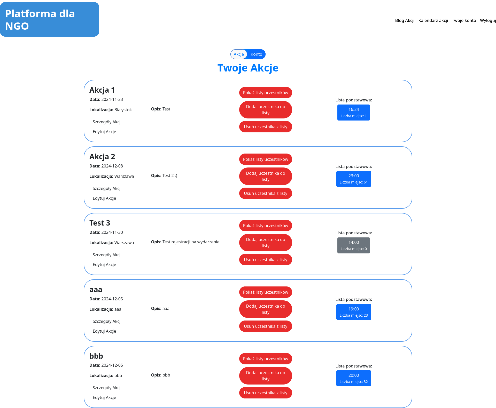
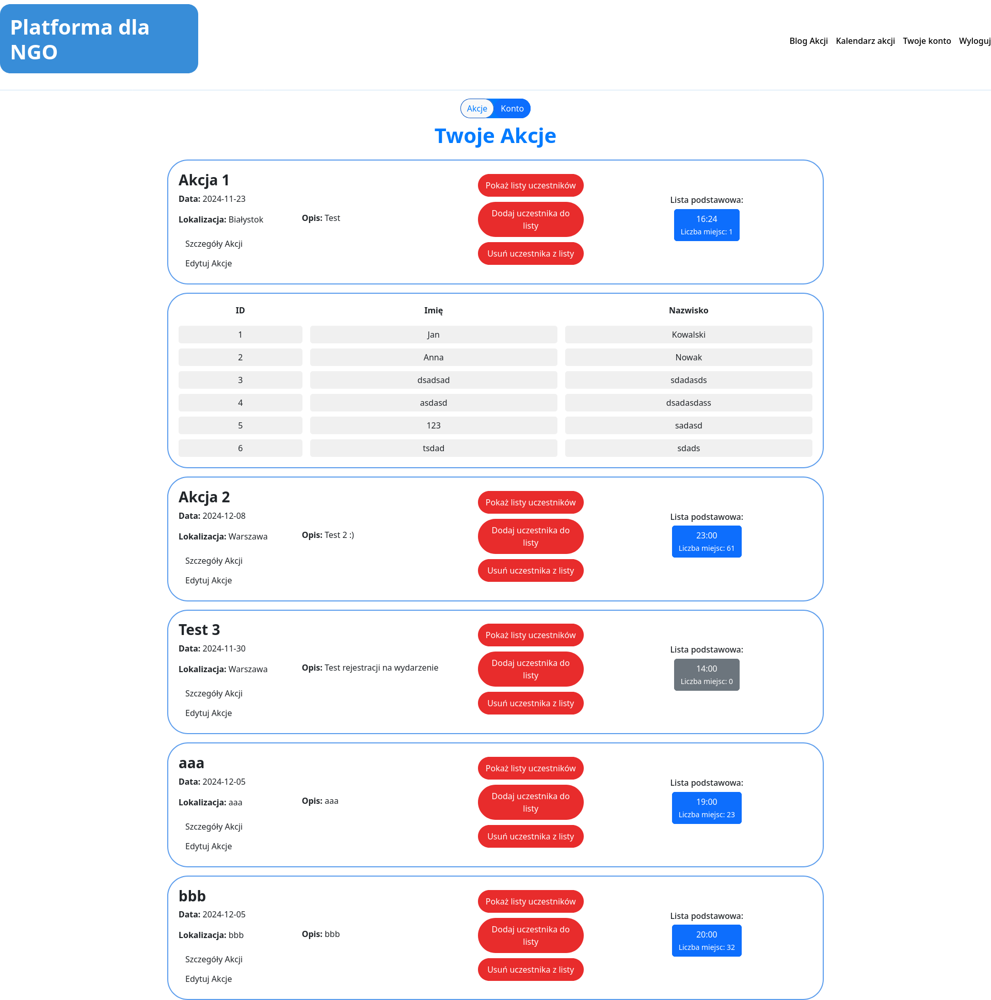

### Dla administratora:

Administrator ma pełny dostęp do zarządzania wydarzeniami oraz użytkownikami w aplikacji.
- **Dodawanie nowych wydarzeń**: Administrator może tworzyć nowe wydarzenia, definiując takie informacje, jak tytuł, opis, data, godzina, lokalizacja oraz liczba dostępnych miejsc.
  
- **Edytowanie wydarzeń**: Administrator ma możliwość edytowania szczegółów istniejących wydarzeń, w tym zmiany daty, godziny, opisu, lokalizacji oraz liczby dostępnych miejsc.
   
   
- **Usuwanie wydarzeń**: Administrator może usunąć wydarzenia z bazy danych, co powoduje ich usunięcie z listy dostępnych wydarzeń.
   

- **Wypisywanie danych administratora**: Administrator ma dostęp do swoich własnych danych.
   
- **Przeglądanie wszystkich wydarzeń**: Administrator ma dostęp do pełnej listy wszystkich wydarzeń w aplikacji, w tym szczegóły każdego wydarzenia.
   
- **Przeglądanie zapisanych użytkowników**: Administrator może zobaczyć, którzy użytkownicy zapisali się na konkretne wydarzenie.
   

- **Dodawanie i usuwanie użytwkoników z wydarzeń**: Administrator może zarządzać, którzy użytkownicy są zapisani na dane wydarzenie, oraz w razie potrzeby usunąć użytkownika z listy.

Administratorzy mają pełną kontrolę nad funkcjonowaniem aplikacji, co pozwala na sprawne zarządzanie wydarzeniami i użytkownikami.
