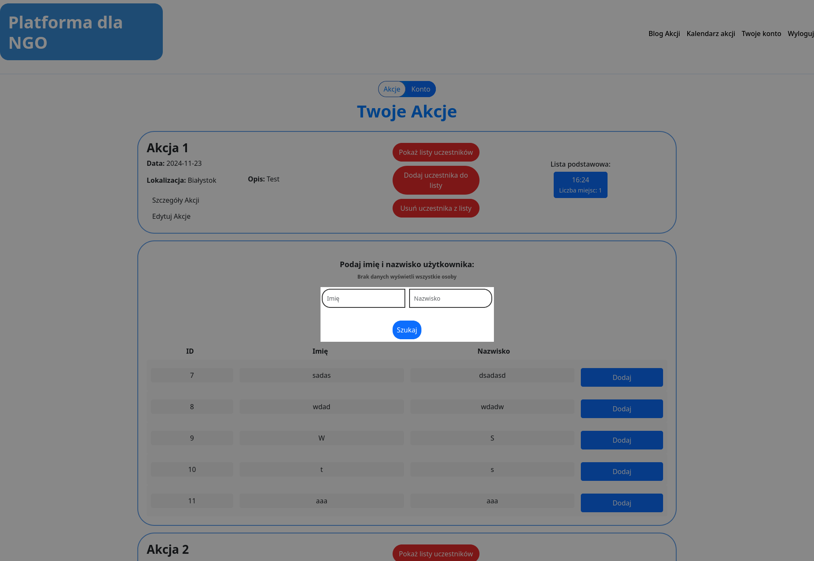
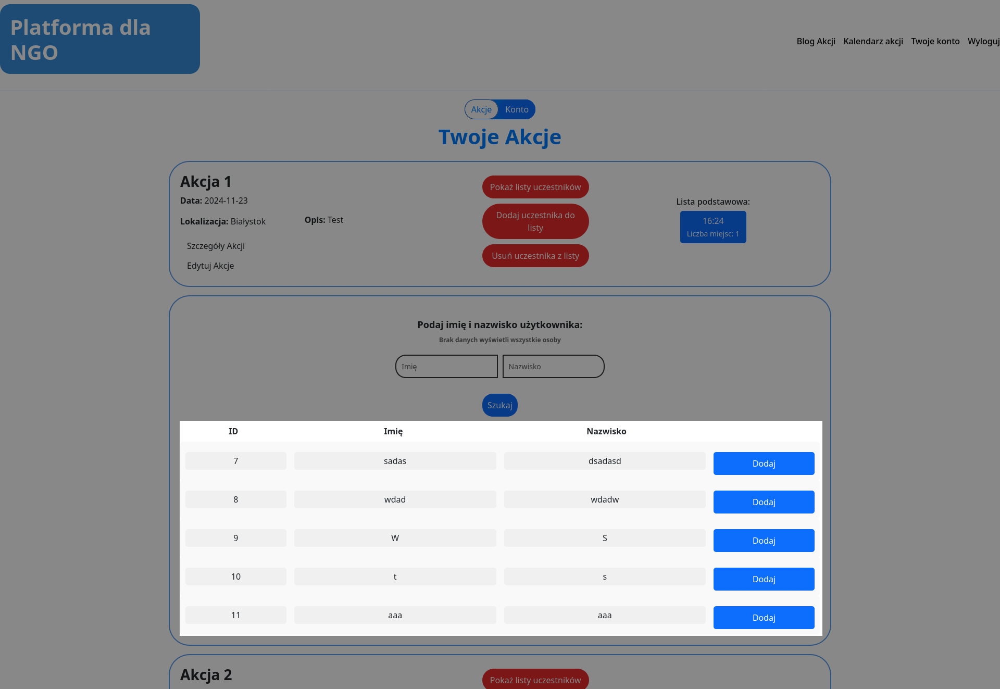

# Administrator
## Wyszukiwanie użytkowników
W pola `Imię` i `Nazwisko` wpisujemy imię lub nazwisko osoby/osób które chcemy dodać do akcji, a następnie wciskamy przycisk `Szukaj`. Po wyszukaniu pojawi się lista dostępnych użytkowników do dodania.

*Pola `Imię` i `Nazwisko` mogą być puste. W przypadku pozostawienia obu pól pustych, dostajemy listę wszystkich użytkowników dostępnych do dodania.

## Dodawanie wyszukanych użytkowników do akcji
Z wyświetlonej listy wybieramy osobę/osoby które chcemy dodać do akcji i wciskamy przycisk `Dodaj` w tej samej kolumnie. Dostaniemy komunikat o dodaniu użytkownika do akcji i ewentualne ostrzeżenie przekroczenia limitu miejsc.

*Widok strony nie odświeża się automatycznie, dlatego warto odświeżyć go ręcznie, by zobaczyć wprowadzone zmiany.

**Ostrzeżenie o przekroczeniu liczby dostępnych miejsc jest tylko komunikatem dla administratora.