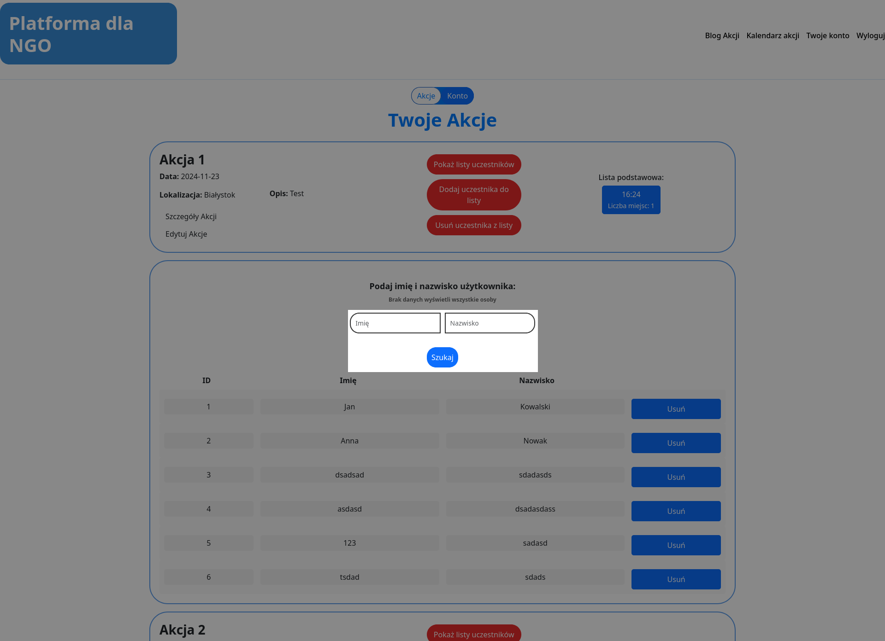
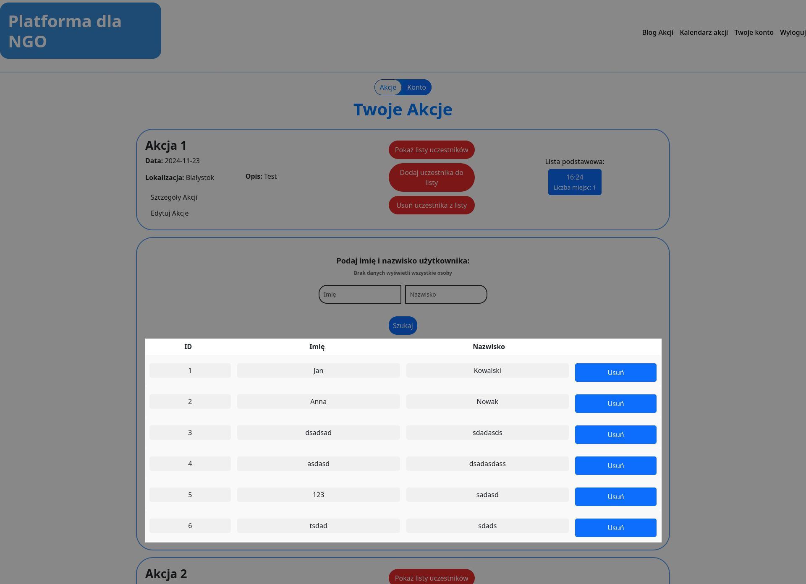

# Administrator
## Wyszukiwanie użytkowników
W pola `Imię` i `Nazwisko` wpisujemy imię lub nazwisko osoby/osób które chcemy usunąć z akcji, a następnie wciskamy przycisk `Szukaj`. Po wyszukaniu pojawi się lista dostępnych użytkowników do dodania.

*Pola `Imię` i `Nazwisko` mogą być puste. W przypadku pozostawienia obu pól pustych, dostajemy listę wszystkich użytkowników dostępnych do dodania.

## Usuwanie wyszukanych użytkowników do akcji
Z wyświetlonej listy wybieramy osobę/osoby które chcemy usunąć z akcji i wciskamy przycisk `Usuń` w tej samej kolumnie. Dostaniemy komunikat o usunięciu użytkownika do akcji.

*Widok strony nie odświeża się automatycznie, dlatego warto odświeżyć go ręcznie, by zobaczyć wprowadzone zmiany.
